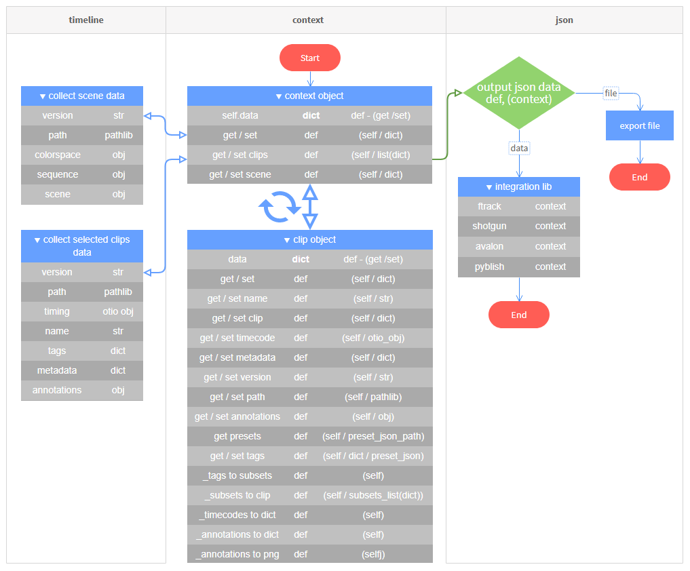

# **pContext**

### project management contextualisation for DaVinci Resolve

   

## Idea:

Version controlling Publisher and Integrator Resolve Python library for any project manager platform (PMP)

## Brief details:w

Inspiration is taken partly from NukeStudio basic concept of Clip Exporter. This python library is about to connect any project manager platform (Ftrack, Shotgun, Avalon, Pyblish) into Resolve. It is also independent on any of them so it could be easily plugged. As we are working with color correcting editorial system we could also develop the way any simple Primary grading could be converted to correct LUT and extracted as pre-look (including looks from on-set-grading with additional stabilizations) and therefore let artists to preview raw data with the same look as in color-grading page in Resolve.

## Vocabulary:

-   _Context_ - dictionary object with collected processing data
-   _Clip_ - entity with stored dictionary data for a clip
-   _Asset_ - a part of a project, such as or Shot (usually a Clip)
-   _Subset_ - a part of an Asset, such as a raw source, plates, nuke script
-   _Version_ - an immutable iteration of a Subset
-   _Representation_ - one of many file representations (extensions) of a Version
-   _Collector_ - micro-plugin with specified set of functions for collecting data from Resolve's context
-   _Integrator_ - micro-plugin with specified set of functions for Integrating data into Resolve's context
-   _Extractor_ - micro-plugin with specified set of functions for Extracting Resolve's data output

## Key features:

-   Publishing context as json data object
    -   Exporting to a json file
    -   Extracting to any linked PMP API
-   Renaming clips with template in sequence or single with additional hierarchy
-   Integrating schema validated data back to timeline (clips, subsets with specified representations)

## UI concept:

Adding timeline context menu items: Publish, VersionUp, VersionDown, VersionMax, VersionMin, Rename; so we could easily operate the library from the Resolve’s context.

Dialogue window for Rename will let a user add hierarchical context to a clip for easy distribution into asset database with parenting. Template for name syntax can be evaluated from preset json file or from gui input field, this can be controlled with a selector.

## Key components:

-   Python 3.6 >
-   OpenTimelineIO
-   OpenColorIO
-   Clique
-   PathLib
-   Json

## Key classes:

-   Context:
    -   Creating temporary staging directory (for faster local exporting)
    -   Send to Resolve's Delivery queue
    -   Load Collectors: CollectSceneData, CollectSelectedClipsData, CollectLookData
    -   Load Extractors: ExtractJson2File, Extract2Ftrack, Extract2Shotgun, Extract2AvalonDB, Extract2Pyblish
    -   Load Integrators: IntegrateClip2Timeline, IntegrateSubsets2Timeline

-   Clip:
    -   Export2png
    -   CreateStagingFolder
    -   Annotations2png
    -   Annotations2dict
    -   Presets2tags
    -   Tags2dict
    -   Tags2subsets
    -   Timecodes2dict
    -   Subsets2clip

-   Version:
    -   VersionUp
    -   VersionDown
    -   VersionMin
    -   VersionMax

-   Rename (gui):
    -   SequencialRename
    -   SequencialRenameWithHierarchy
    -   SingleRename
    -   SingleRenameWithHierarchy
    -   GetNameTemplate (from presets or gui input)

## OpenSource license:

-   Apache 2.0

## Main Data flow chart

